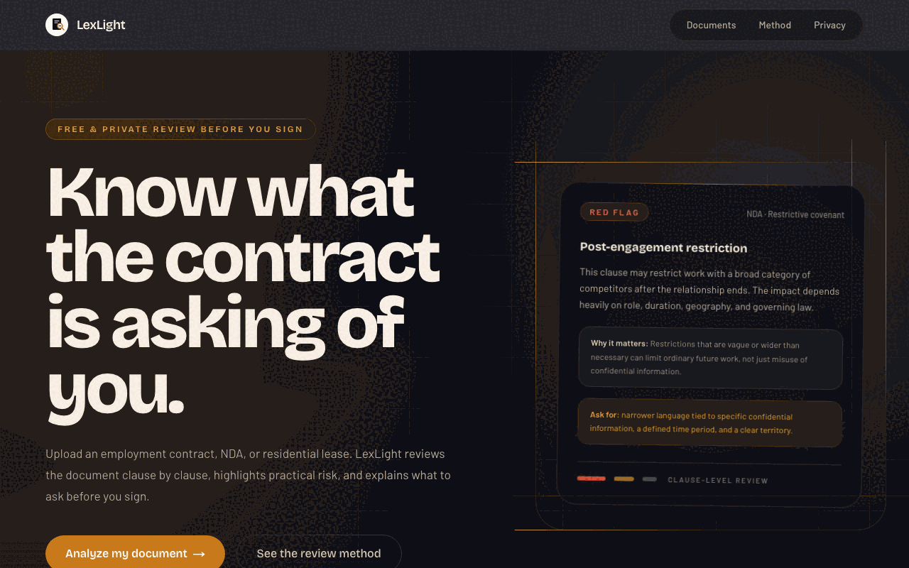

# LexLight

> Free, plain-English legal document analysis. Understand contracts, leases, and terms of service in minutes.

**Live:** https://lexlight.vercel.app

## What is this

LexLight reads a legal document and explains it the way a careful friend who happens to be a lawyer would — in plain English, clause by clause. Upload a contract, NDA, or lease and get a structured report that flags the risks, the missing protections, and the deadlines that matter.

It's built for the person signing the document, not the one who wrote it.

## What it does

- **Identifies the contract type** and reviews each clause in context
- **Flags risk** per clause with clear, color-coded levels
- **Surfaces missing clauses**, key dates and deadlines, and your rights and obligations
- **Answers unlimited follow-up questions** about your document
- **Exports** the analysis to PDF or Markdown, and shares a read-only link
- **Privacy-first** — documents are analyzed without being stored on the server

---

> LexLight provides informational analysis only and is **not legal advice**. For decisions that matter, consult a qualified attorney.
