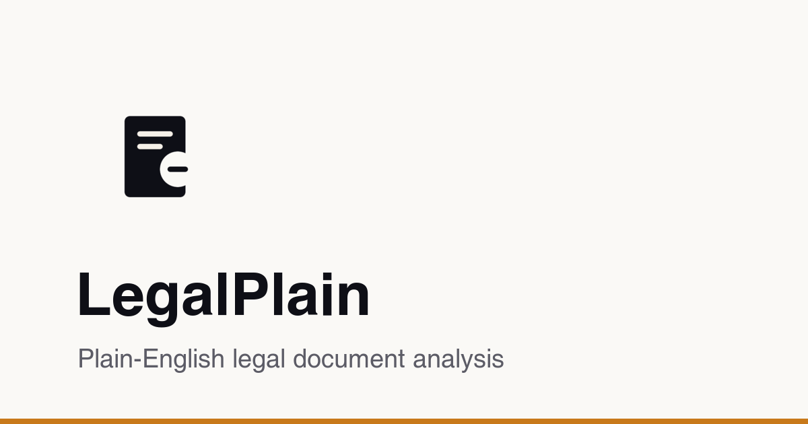

# LexLight

[](https://github.com/deepakkumardewani/legal-plain/actions/workflows/ci.yml)


[](https://legal-plain.vercel.app)

> Free, plain-English legal document analysis. Understand contracts, leases, and terms of service in seconds.

**Live:** https://legal-plain.vercel.app



## What is this

LexLight reads a legal document and explains it the way a careful friend who happens to be a lawyer would — in plain English, clause by clause. Upload a contract, NDA, lease, or offer letter and get a structured report that flags the risks, the missing protections, and the deadlines that matter.

It’s built for the person signing the document, not the one who wrote it.

## What it does

- **Identifies the contract type** and reviews each clause in context
- **Flags risk** per clause with clear, color-coded levels
- **Surfaces missing clauses**, key dates and deadlines, and your rights and obligations
- **Answers unlimited follow-up questions** about your document
- **Exports** the analysis to PDF or Markdown, and shares a read-only link
- **Privacy-first** — documents are analyzed without being stored on the server

## Where to start

1. Open the [live app](https://legal-plain.vercel.app)
2. Upload a PDF or paste your document text
3. Read the structured, plain-English report

## Running locally

This project uses [Bun](https://bun.sh).

```bash
bun install
bun run dev
```

Copy `.env.local.example` to `.env.local` and fill in the required values (AI provider key, Redis credentials for sharing/rate-limiting).

| Command | Purpose |
| --- | --- |
| `bun run dev` | Start the dev server |
| `bun run build` | Production build |
| `bun run verify` | Lint, format check, type-check |
| `bun run test` | Unit tests (Vitest) |

## Built with

[Next.js 16](https://nextjs.org) · [React 19](https://react.dev) · [Tailwind CSS](https://tailwindcss.com) · [Vercel AI SDK](https://sdk.vercel.ai) · [Upstash Redis](https://upstash.com)

---

> LexLight provides informational analysis only and is **not legal advice**. For decisions that matter, consult a qualified attorney.
